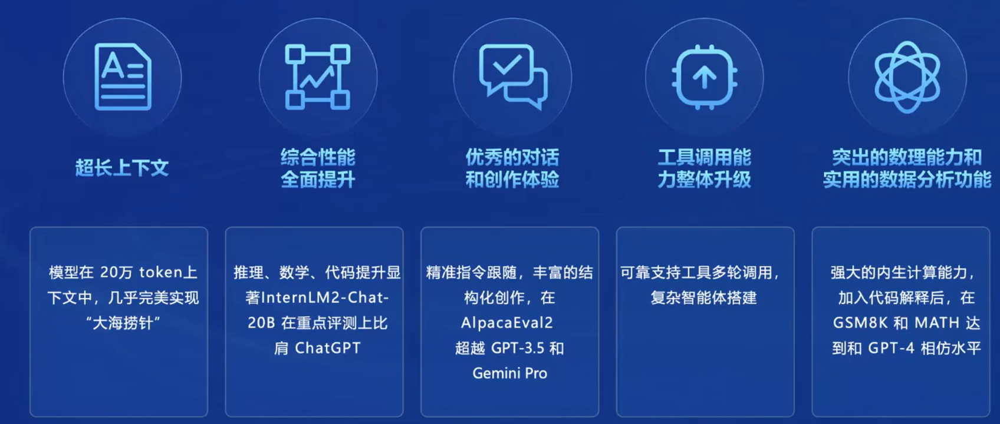
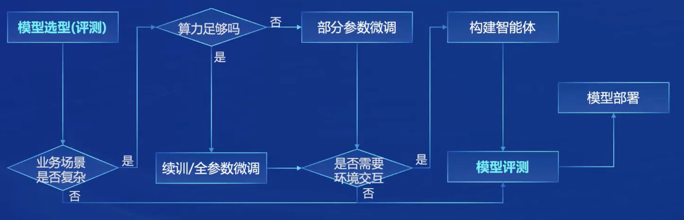
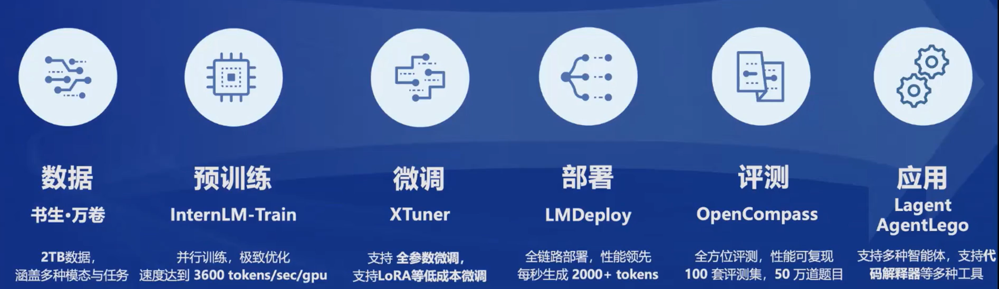
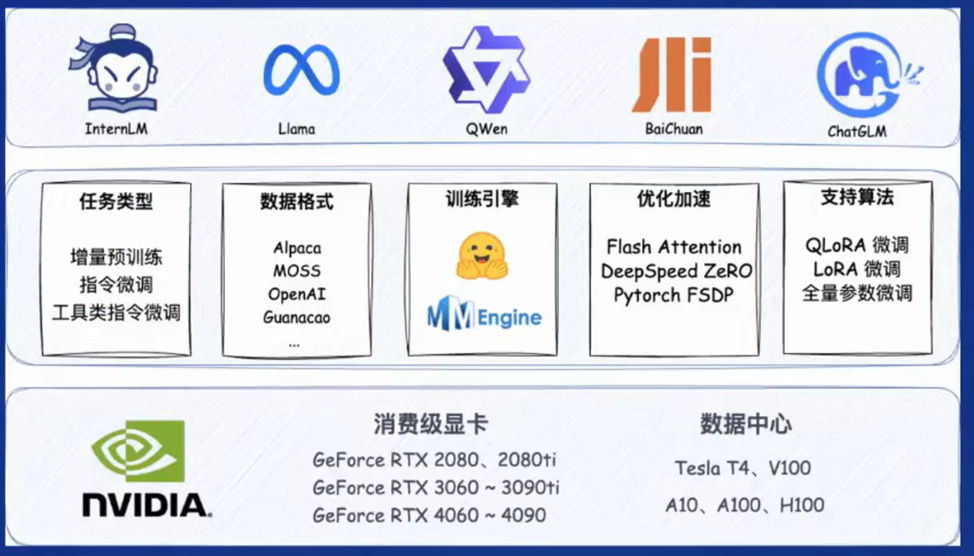
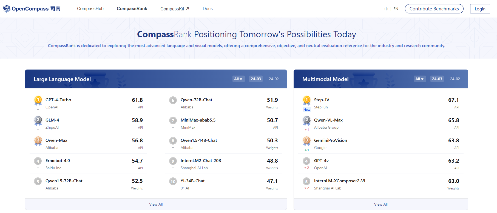
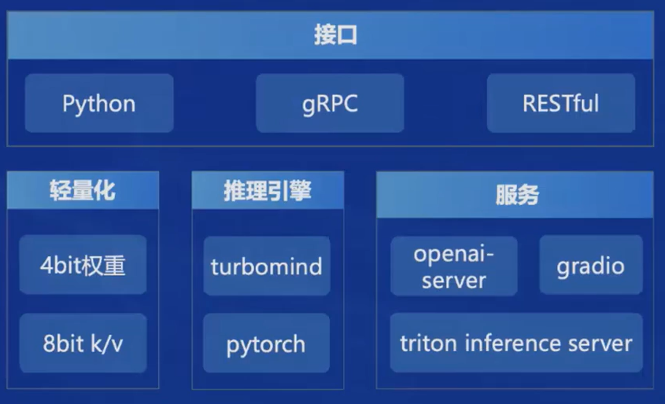

# 书生第一期学习笔记

## InternLM2的主要亮点

 
## 从模型到应用典型流程

## 书生·浦雨全链条开放体系
书生·浦语提供的开源链条总共有六个部分，分别为：数据、预训练、微调、部署、评测和应用

### 数据
数据包含书生·万卷1.0和书生·万卷CC。万卷1.0的数据量比较大且包含图像、视频等多模态数据；而万卷CC则质量更高，是唯一在毒性、色情和个人隐私进行了加固处理的数据集，可能可以使模型在对齐阶段需要的操作更少。
### 预训练
预训练提供了InternEvo框架，主要具有**高可扩展性**、**极致性能优化**、**兼容主流**、**上手简单**四个特点。
### 微调
微调阶段开发了XTuner的框架，支持**增量续训**和**有监督微调（SFT）**，并且在SFT中支持全量参数微调，也支持使用LORA等方法进行部分参数微调，这给算力有限的开发者提供了更多的选择和测试的机会。

### 评测
评测框架在今年初进行了重大升级，发布了OpenCompass2.0司南大模型评测体系。

这个评测体系可以根据模型的功能进行分类评测，比如LLM和多模态模型，也支持细分领域的单独打分，比如医学、法律等。
新推出的Open Compass针对**数据污染检查**、**模型推理接入**、**长文本能力评测**、**中英文双语主观评测**进行了更新。
### 部署
部署阶段提供了LMDeploy框架，包括模型轻量化、推理和服务。

### 智能体
针对智能体的开发，推出了Lagent框架，支持多种大语言模型，扩展性好。
同时提供了多模态智能体工具箱AgentLego，可以使用大量视觉、多模态领域的前沿算法，并支持主流的智能体系统，如LangChain、Transformers Agent等。