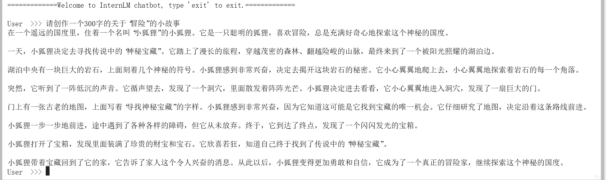
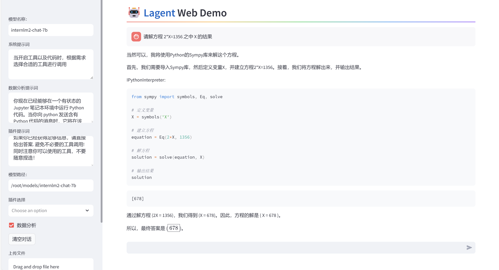
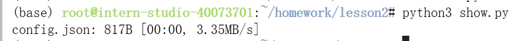

# 书生·浦语大模型训练营第二节课笔记
教程链接：https://github.com/InternLM/Tutorial/blob/camp2/helloworld/hello_world.md
作业要求：https://github.com/InternLM/Tutorial/blob/camp2/helloworld/homework.md
## 基础作业
### HW1-使用 InternLM2-Chat-1.8B 模型生成 300 字的小故事
部署成功截图；

## 进阶作业
### HW2-Lagent 工具调用 数据分析 Demo 部署
部署成功截图：

### HW3-使用huggingface进行模型下载
使用教程中的查看文件可以确定下载成功
