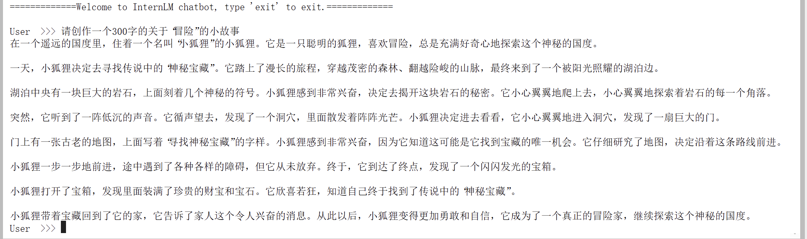

# 书生·浦语大模型训练营第二节课笔记
## 基础作业
### HW1-使用 InternLM2-Chat-1.8B 模型生成 300 字的小故事
部署成功截图；

尝试修改system prompt，以改变模型的输出模式（失败）

模型接受了设定，但在回复的时候并没有遵守

上届优秀作品：八戒

## 进阶作业
### HW2-Lagent 工具调用 数据分析 Demo 部署
部署过程中遇到报错，经检查是model_path配置的时候写错了

部署成功截图：

### HW3-使用huggingface进行模型下载
#### huggingface介绍
Hugging Face是一家美国公司，专门开发用于构建机器学习应用的工具。该公司的代表产品是其为自然语言处理应用构建的transformers库，以及允许用户共享机器学习模型和数据集的平台。
摘自：https://zh.wikipedia.org/wiki/Hugging_Face

网站截图

按照教程创建下载的py文件

使用教程中的查看文件可以确定下载成功
