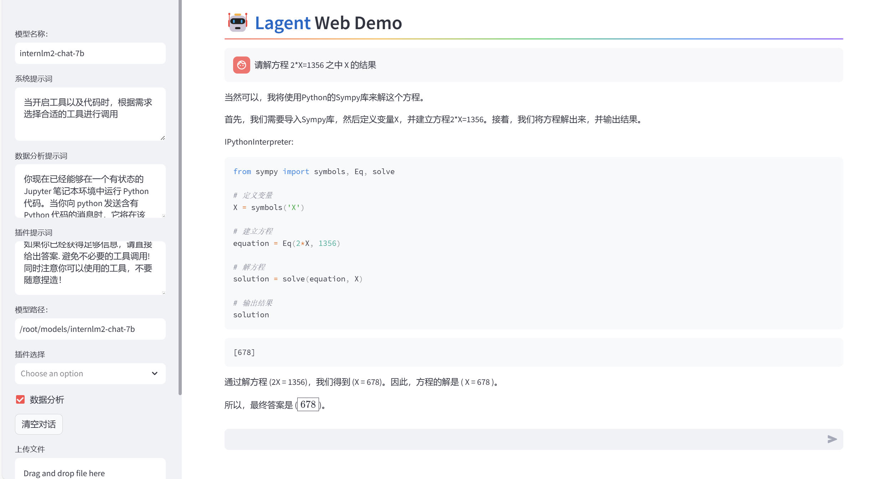

# 书生·浦语大模型训练营第二节课笔记
## 基础作业
### HW1-使用 InternLM2-Chat-1.8B 模型生成 300 字的小故事
部署成功截图；

尝试修改system prompt，以改变模型的输出模式（失败）

模型接受了设定，但在回复的时候并没有遵守

上届优秀作品：八戒

## 进阶作业
### HW2-Lagent 工具调用 数据分析 Demo 部署
部署过程中遇到报错，经检查是model_path配置的时候写错了

部署成功截图：

### HW3-使用huggingface进行模型下载
#### huggingface介绍
Hugging Face是一家美国公司，专门开发用于构建机器学习应用的工具。该公司的代表产品是其为自然语言处理应用构建的transformers库，以及允许用户共享机器学习模型和数据集的平台。
摘自：https://zh.wikipedia.org/wiki/Hugging_Face

<center>网站截图</center>

按照教程创建下载的py文件（全部下载）
```python
import os
# 下载模型
os.system('huggingface-cli download --resume-download internlm/internlm2-chat-7b --local-dir your_path')
```
部分下载代码：
```python
import os
from huggingface_hub import hf_hub_download # Load model directly
hf_hub_download(repo_id="internlm/internlm-7b", filename="config.json”)
```
使用教程中的查看文件可以确定下载成功

查看文件：
```python
#show.py
import os 
from huggingface_hub import hf_hub_download  # Load model directly 
hf_hub_download(repo_id="internlm/internlm2-7b", filename="config.json")
```
### HW4-部署浦语·灵笔2模型
注：使用的图片为网图，如侵权请联系作者删除
按照教程安装依赖库的时候遇到报错

按照报错安装cmake、lit并修改huggingface-hub的版本
```
pip install cmake
pip install lit
pip install huggingfac-hub==0.16.4 
```
遇到了新的报错，提示gradio要求另一个版本的huggingface-hub

最后选择了满足gradio的huggingface-hub版本进行尝试（成功）
图文创作部署成功截图：

视觉问答部署成功截图：

可以看到llm生成的还存在一定问题，换一张简单的图片试试

对于颜色的描述出现冲突，这里尝试把beam size的值调大一点，看看能不能输出更好的答案

依旧存在一点小缺陷，但大体还过得去
把beam size和最多字数调大后，重新尝试理解最开始较复杂的图片

情况并没有好很多。。。但最开始的把ing理解为两个词的错误没有出现