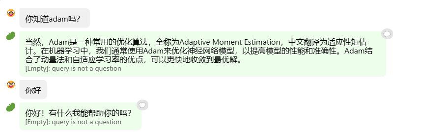
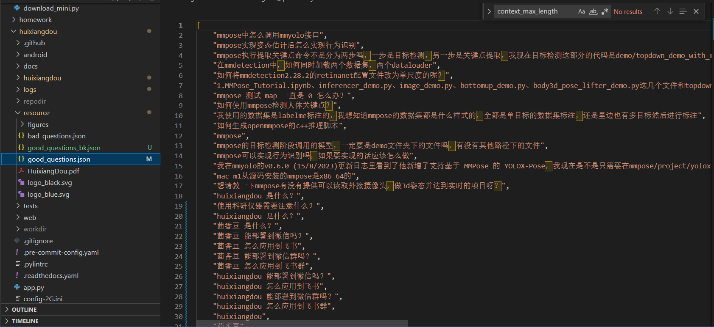
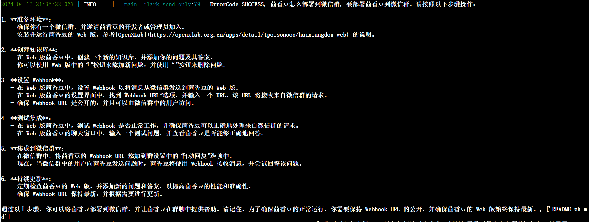

# 书生·浦语大模型训练营第三节课笔记
## 基础作业
### 作业一
### 视频学习笔记：  
#### RAG
RAG是一种结合了检索和生成的技术，旨在通过利用外部知识库来增强大语言模型的性能。它通过检索与用于输入相关的信息片段，并结合这些信息来生成更准确、更丰富的回答。  

可以将RAG理解为一个搜索引擎，将用户输入的query作为索引，在内部知识库中搜寻内容，然后结合llm的能力进行回答。RAG可以解决llm在处理知识密集型任务时可能遇到的挑战，解决llm所具有的幻觉问题。  

RAG本身并不需要再次训练，所以应用成本较低。
#### RAG工作原理
RAG可以分为三个部分，分别为索引、检索和生成
##### 索引
索引部分负责将知识源（如文档或网页）分割成chunk，编码成向量，并存储在向量数据库中
##### 检索
接收到用户的问题后，将问题也编码成向量，并在向量数据库中找到与之最相关的文档块（top-k chunk）
##### 生成
将检索到的文档块与原始问题一起作为prompt输入到llm中，生成最终的回答。
#### 向量数据库
向量数据库是实现快速准确回答的基础。它主要具备以下三个功能：  
**数据存储**：将文本及其它数据通过其它预训练的模型转换为固定长度的向量表示，这些向量能够捕捉文本的语义信息。  
**相似性检索**：根据用户的查询向量，使用向量数据库快速找出最相关的向量的过程。通常通过计算余弦相似度或其他相似度度量来完成。检索结果根据相似度得分进行排序，最相关的文档将被用于后续的文本生成。  
**向量表示的优化**：包括使用更高级的文本编码技术，如句子嵌入或段落嵌入，以及对数据库进行优化以支持大规模向量搜索  

**FAISS介绍**：FAISS是一个允许开发者快速搜索相似多媒体文件的embedding向量的库。它解决了传统查询搜索引擎的限制，并对基于哈希的搜索进行了优化，并提供了更可扩展的相似性搜索功能。

### 茴香豆官方网页版对话截图
上传了一个深度学习的八股文件

前两个问题过于简单，被茴香豆识别为不需要使用数据库

第三个问题问的更细了点，茴香豆使用了上传文件中的知识

第四五问题同理：

### 作业二
good question配置：

测试列表截图；

提取文件结果截图：

成功提取22个文件，异常26个  
成功回答第一个问题 “huixiangdou 是什么”：

成功回答第二个问题 “茴香豆怎么部署到微信群”：

第三个问题 “今天天气怎么样？”：

输出结果与教程一致，因为助手判断问题主题与预料主题不符，所以拒绝回答该问题