# 书生·浦语大模型训练营第三节课笔记
## 基础作业
### 作业一
上传了一个深度学习的八股文件

前两个问题过于简单，被茴香豆识别为不需要使用数据库
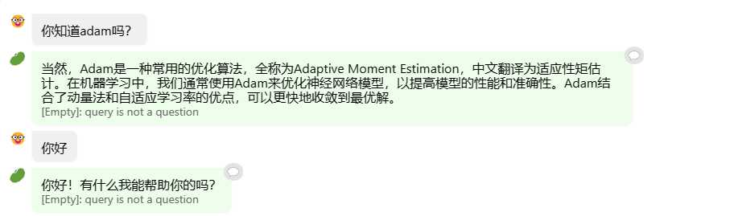
第三个问题，茴香豆使用了上传文件中的知识
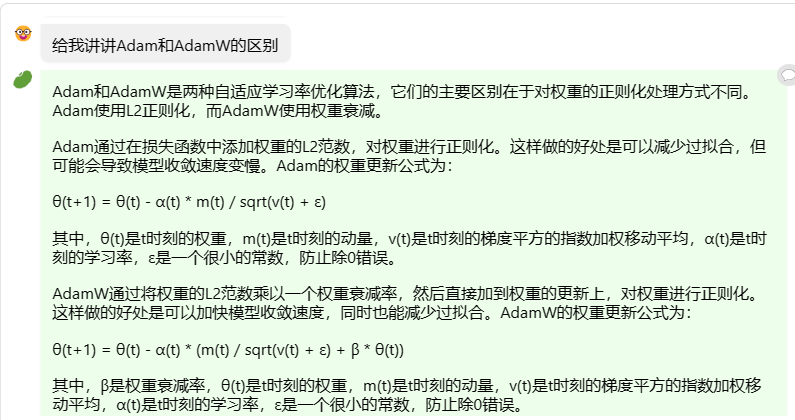
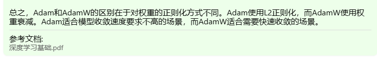
第四五问题同理：
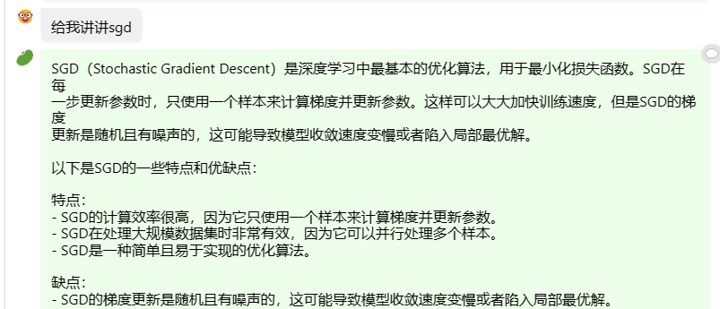
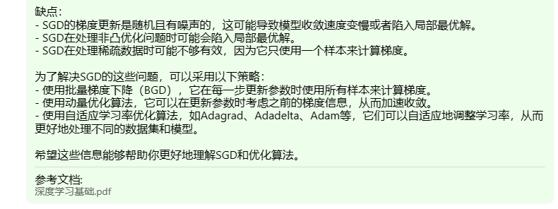
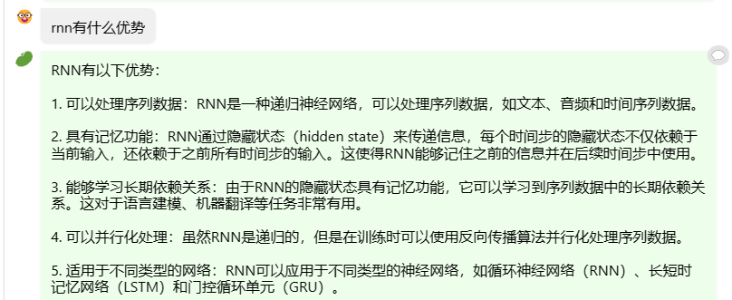

### 作业二
创建conda环境
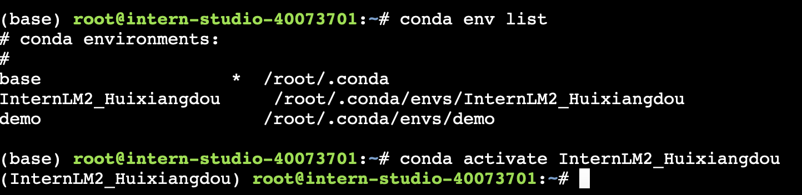
修改配置
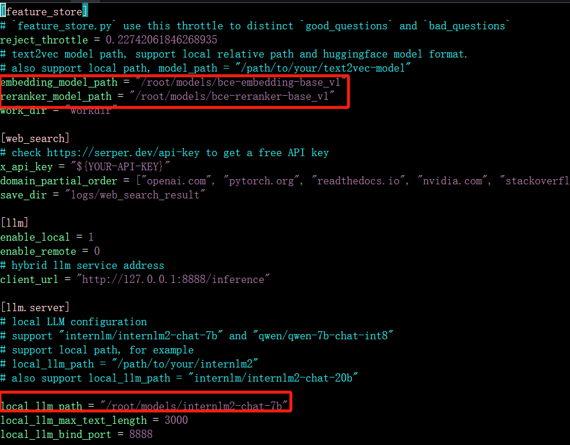
创建向量数据库的时候，成功拒绝问答中的简单问题，但报错：
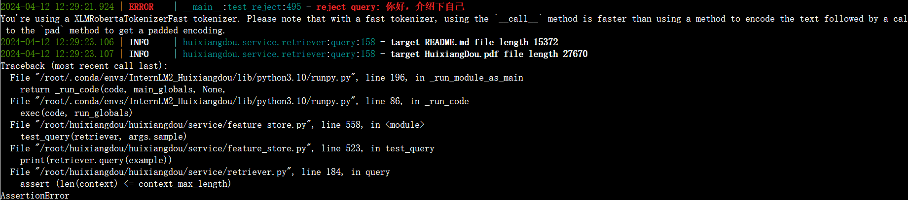
```python
assert (len(context) <= context_max_length)
```
尝试将context_max_length放大十倍，修改:  
/root/huixiangdou/huixiangdou/service/retriever.py
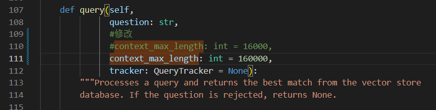
不出现报错，但后面输出了很多文本，不知道是什么原因。。。  
**补：**看完视频后，认为应该是加长了最长文本长度，所以综合文件数更多，导致输出的相关语料也变多了  
继续进行实验，尝试问茴香豆教程中的三个问题：
成功回答第一个问题：
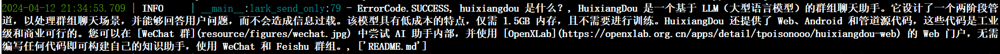
成功回答第二个问题：
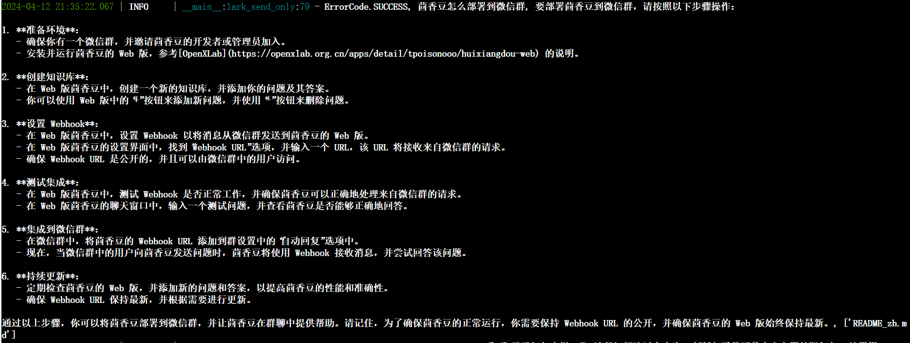
第三个问题：
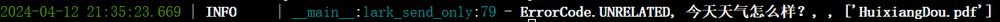
输出结果与教程一致，因为助手判断问题主题与预料主题不符，所以拒绝回答该问题


