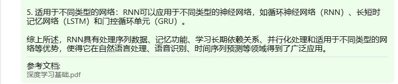

# 书生·浦语大模型训练营第三节课笔记
## 基础作业
### 作业一
上传了一个深度学习的八股文件
前两个问题过于简单，被茴香豆识别为不需要使用数据库

第三个问题，茴香豆使用了上传文件中的知识


第四五问题同理：



### 作业二
创建conda环境

修改配置

创建向量数据库的时候报错（待解决）

尝试安装运行中提示的库，问题依旧存在


后续运行截图
询问1：

询问2：

询问3出现报错，提示下面这行不符合假设
```python
assert (len(context) <= context_max_length)
```
尝试将context_max_length放大十倍，修改:  
/root/huixiangdou/huixiangdou/service/retriever.py

依旧没有效果  
报错代码是“ErrorCode.UNRELATED”，推测为是没有相关的信息

